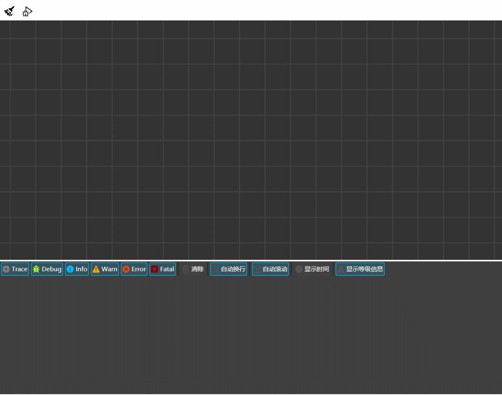
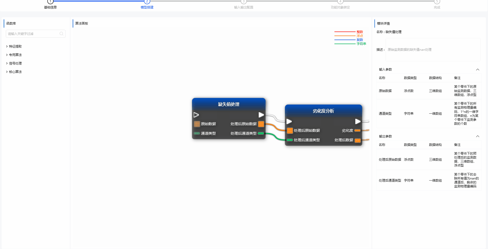

# ResumeDemo

##
### WPF控件

### 三维交互

- 支持自定义
	- 模型 
	> 自定义显示三维模型
	- 锚点
	> 自定义数据显示锚点
- 交互显示
	- 焦点部分高亮
	> 鼠标焦点部分材质替换，高亮显示当前焦点部分模型
	- 锚点跟随
	> 旋转、缩放、移动模型时自动更新锚点
	- 动态数据显示
	> 支持为锚点添加数据源并显示在界面，可定时动态刷新
</detail>

#### 蓝图（2.0）

##### 概述

- 本地部署
	> 本地运行，无需服务端部署。
	- 事件驱动
	> 通过事件驱动节点流程执行，支持单流程中存在多个事件节点。
	- 本地可调试
	> 基于C#提供的动态运行时相关（Assembly、Expression等）功能，生成节点类实例，调用指定方法以支持本地运行调试。
	- 本地指令控制与状态输出
	> 使用控制台控件，支持相关调试信息输出；支持用户指令输入，支持指令历史记录

- 高扩展
	- 特性标记转换
	> 通过针对函数、属性、字段相关特性，在载入时解析，自动转化生成对应功能节点，方便进行功能扩展。
	- 支持插件
	> 支持插件路径配置，自动查找、生成功能节点
	- 自动生成运行、回调实例
	> 进入调试模式时自定解析功能节点，生成必要的实例、回调函数，作为流程运行中非静态函数调用的实例对象
	- 自定义功能节点样式
	> 支持在外部库中自定义节点样式，在转换成功能节点时自动注入相关行为，以支持拖拽、连线等功能

- 交互性友好
	- 提示友好
	> 节点参数槽支持类型显示
	>  节点参数槽链无法接时支持错误提示
	- 功能节点自动关联搜索
	> 支持在节点候选菜单中全局查找包含指定关键字的节点
	>  支持在链接参数插槽时自动关联支持此插槽对应类型链接的节点的显示
	- 突出活动对象
	> 编辑状态中选中节点会高亮此节点
	>  悬停在参数槽会高亮相关参数链接线及对端参数槽
	>  悬停在链接线上会弱化非悬停线的显示
	>  调试模式下会动态突出显示当前执行节点及连线
	- 支持注释组
	> 支持对多个节点组选，并归为一组，拖动组将一并拖动组内节点
	>  可自行设定组标题、背景颜色用于标注

##### 开发计划及进度

- [x] 动态生成与运行调试
	- [x] 基本框架、样式
	- [x] 基于特性的转换，调试运行
	- [ ] debug断点与调试时数据显示 
- [ ] 源代码生成
- [ ] 编译与自动打包

</detail>

<detail>

#### 蓝图（1.0）

- 支持算法节点可视化编辑

> 从算法列表中拖拽到画布中自动生成可视化对象显示；自由组织、调整数据处理流程

- 属性详情显示

> 显示当前算法块描述、输入输出参数详情

- 远端序列化传送

> 通过自定义序列化格式传输调用链相关信息，由远端进行执行任务生成与调度

</detail>

<detail>
### UnrealEngine

#### 材质示例

</detail>
